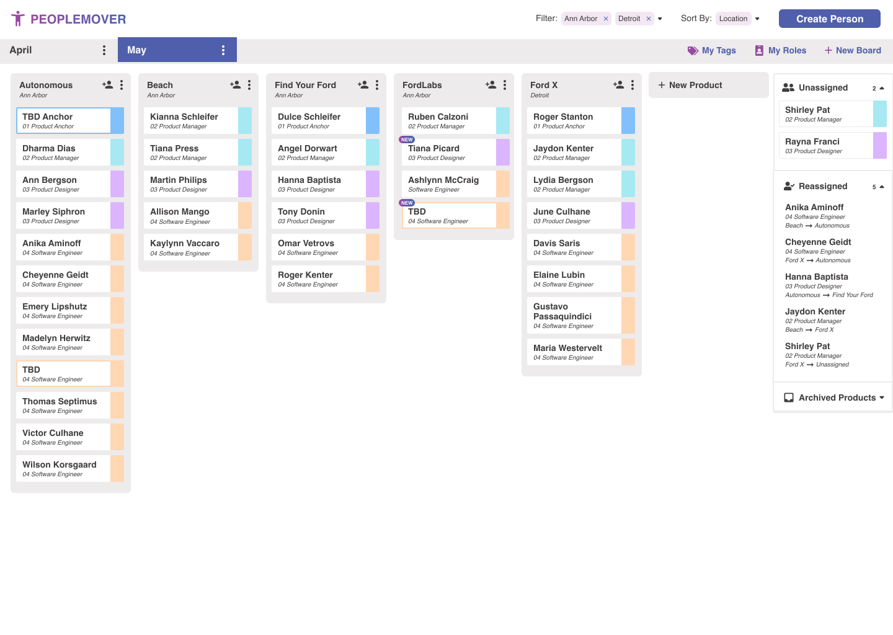

# PeopleMover

> 

PeopleMover is about the people.

Your people.

And helping them be extraordinary.

Most allocation applications focus solely on projects and schedules, and seem to forget that a product is only as
successful as its team. PeopleMover focuses on the people, helping you create and fluidly maintain balanced teams
well suited for the product at hand – because we understand that a great team sets the stage for incredible results.

# Running the project
- Start with the [backend](./api/README.md)
- After the backend is running start the [frontend](./ui/README.md)
